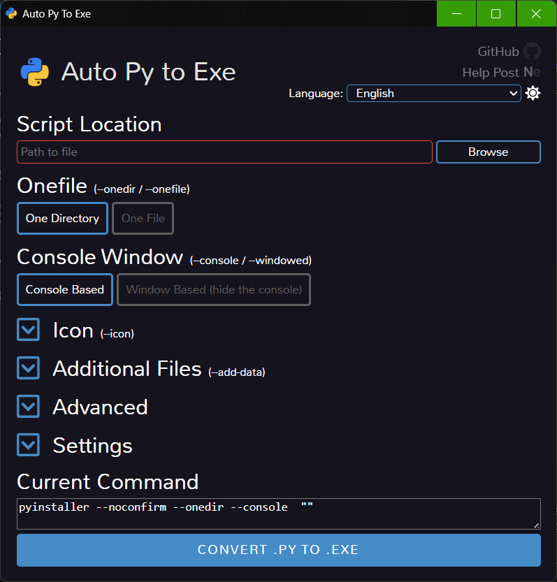

---

## 🧠 **Explicación del Código y Objetivo**

🔧 Aún no funciona el `.exe`, pero se ha avanzado en la **conversión de un script en Python a un archivo ejecutable**.

🧪 El script realiza dos tareas principales:

1. 🔍 **Escaneo de puertos COM** disponibles en el sistema.
2. 🌐 **Escaneo de Streams LSL (Lab Streaming Layer)** para detectar flujos activos.

🎯 **Objetivo del script:**

* Analizar los streams disponibles.
* Establecer **condicionales** basadas en los **límites superiores e inferiores** de dichos streams.
* Identificar los canales utilizados si existen múltiples.
* 📡 Después del mapeo de umbrales, el script **envía datos al puerto COM** para comunicarse con un **microcontrolador**.


---

## 📦 **Dependencias para el Script**

🔗 Para que el script funcione correctamente, se deben instalar ciertas librerías especificadas en el archivo `requirements.txt`.

🔧 **Pasos para instalar:**

1. Abre el archivo `requirements.txt` con **Visual Studio Code**.
2. Haz clic derecho sobre el archivo y elige **"Abrir en terminal"**.
3. Ejecuta el siguiente comando en la terminal:

```bash
pip install -r requirements.txt
```

✅ Esto instalará todas las dependencias necesarias con las versiones adecuadas.

---

## 🛠️ **Conversión del Script Python a .EXE**

Para convertir tu script en un ejecutable, necesitas una herramienta especial.

📥 **Instalación de la herramienta:**

```bash
pip install auto-py-to-exe
```

🚀 **Para ejecutar el programa:**

```bash
auto-py-to-exe
```


🧭 **Pasos en la interfaz gráfica:**

1. 🌍 **Selecciona el idioma** de la interfaz.
2. 📂 Establece la **ruta del script `.py`**.
3. ⚙️ Elige entre:

   * ✔️ **Archivo único** (todo en un `.exe`).
   * 📁 **Directorio** (útil si tienes archivos adicionales como imágenes, sonidos, etc).

🖥️ Si tu script **no tiene interfaz gráfica**, selecciona la opción que **muestra la consola**.

🚫 Si **sí tiene interfaz gráfica**, puedes **ocultar la terminal** para una experiencia más limpia.

💡 Mostrar la consola es útil cuando necesitas **ver mensajes de depuración** o el **estado de ejecución**.

🎨 Puedes personalizar:

* El **icono del archivo ejecutable** (`.ico`).
* Agregar **archivos/carpetas adicionales** que tu script necesite para funcionar.

📌 Con estas opciones básicas puedes **crear tu ejecutable `.exe`**, aunque hay configuraciones avanzadas si lo necesitas.

---

## 🧠 **Recomendaciones con Auto-Py-to-Exe**

💡 Cuando ejecutas el script desde tu entorno de desarrollo (ej. Visual Studio Code), todo funciona "en vivo". Pero al generar el `.exe` se crea un **entorno congelado** con las siguientes consideraciones:

❌ **NO se actualiza automáticamente la metadata** de los paquetes.
🔎 Funciones como `importlib.metadata` o `pkg_resources` pueden fallar al buscar versiones de paquetes.

📦 **Pip tampoco funciona igual** dentro del `.exe`: aunque se intente instalar algo, no se refleja correctamente en el ejecutable.

✅ **Recomendación:**
👉 **No incluyas verificadores de dependencias** en tu versión congelada.
En lugar de eso, asegúrate de que todo esté incluido **antes de generar el `.exe`**.

💡 Si deseas mantener opciones de actualización dinámica para el entorno de desarrollo, puedes usar una condición para detectar si el script está congelado:

```python
import sys
if getattr(sys, 'frozen', False):
    # Estamos en un .exe
    pass
else:
    # Estamos en entorno de desarrollo
    pass
```

---

## 🧾 **Resumen Final**

🛠️ Tu script:

* Detecta puertos COM y Streams LSL.
* Mapea límites y canales.
* Envía datos al microcontrolador.
* Fue convertido a `.exe` con **auto-py-to-exe**.

📋 Requiere instalar librerías vía `pip install -r requirements.txt`.

⚠️ Ten en cuenta las limitaciones del `.exe` respecto a instalación o verificación de dependencias.

---

Si deseas, puedo ayudarte a depurar por qué aún no funciona el `.exe`. ¿Quieres que revisemos eso también?
